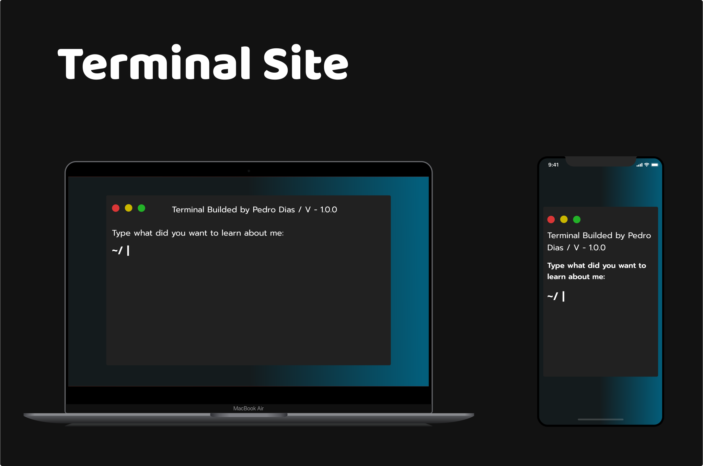

<h1 align="center">
  
</h1> 

<h2 align="center">Link to site online: <a href="https://pedro-dias.vercel.app/" target="_blank">Terminal Site</a> </h2>

 My personal site, for people learn more about me, my skills, vscode settings and more! 🎉 

---

## 🔖 Layout
- [Personal Site - Figma](https://www.figma.com/file/jDW8u7N3EpoZEp5HxuIHEY/Personal-Site?type=design&node-id=1-3&mode=design&t=ddsFa3XR33fJFxXL-0)

 

Made with ♥ by Pedro Dias. 👋 Follow me on social media! 

 

If you can give a little star, I appreciate it 🤩
